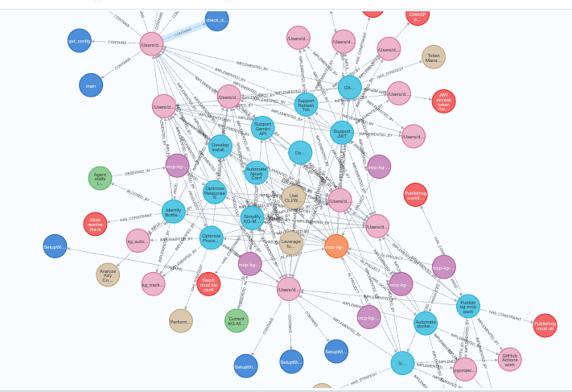

# 🧠 MCP-KG-Memory

<div align="center">


**The Long-Term Memory Layer for AI Coding Agents**

*Give your AI Assistant a brain that persists context, learns from past mistakes, and understands your project's goals.*

[Quick Start](#-quick-start) • [Features](#-features) • [Installation](#-installation) • [Configuration](#-configuration) • [License](#-license)

</div>

---

## 📖 Overview

**MCP-KG-Memory** is a production-grade **Model Context Protocol (MCP) Server** designed to solve the "context amnesia" problem in AI coding assistants (Cursor, Windsurf, VS Code, Antigravity).

Instead of starting from zero every session, this system maintains a persistent **Knowledge Graph** of your project. It acts as an active memory layer that tracks:
- **🎯 Goals & Status:** What are we building? What is done?
- **🛑 Constraints & Rules:** Architectural decisions, forbidden patterns.
- **💡 Strategies & Outcomes:** What worked? What failed? (Automatic learning)
- **❤️ User Preferences:** How do you like your code written?
- **🔗 Code Relationships:** Semantic links between goals and specific files.

### 📸 Visualization
*Real-time visualization of the Knowledge Graph memory structure.*



---

## ✨ Features

### 🧠 Active Context Injection (`kg_autopilot`)
Every time you start a task, the agent consults the memory. It automatically retrieves:
- Active goals relevant to your current work.
- Past failed attempts (to avoid repeating them) and successful strategies.
- Your specific coding preferences (SOLID, Clean Arch, etc.).

### 🔍 Semantic & Graph Search
Don't just grep strings. The system traverses the graph (k-hops) to find connected context.
*"I'm working on Auth"* → Retrieval includes User model, JWT utility, and the relevant security constraints defined 2 weeks ago.

### 📝 Strategic Learning
The system isn't static. It learns:
- **Implicit Learning:** Infers strategies and patterns from your conversations.
- **Outcome Tracking:** Remembers if a strategy "Success" or "Failure" to guide future decisions.

### ⚡ Technology Stack
- **Core:** Python 3.11+
- **Database:** Neo4j (Graph Database)
- **LLM:** Google Gemini 2.5 (via Direct API or LiteLLM Gateway)
- **Protocol:** Model Context Protocol (MCP)

---

## 🚀 Installation

You can install `kg-mcp` globally using `pipx` (recommended) or in a local virtual environment.

### Prerequisites

- **Python 3.11+**
- **Docker** (for running Neo4j locally)
- **Gemini API Key** ([Get Key from Google AI Studio](https://aistudio.google.com/api-keys))

### Option 1: One-Line Install (Recommended)

```bash
# Install the package
pipx install kg-mcp

# Run the interactive Setup Wizard
kg-mcp-setup
```

The wizard will:
1.  Check for Docker and Neo4j.
2.  Ask for your **Gemini API Key**.
3.  Configure the **LLM Mode** (Direct vs LiteLLM).
4.  Generate a secure `.env` file.

### Option 2: Manual Development Setup

```bash
# Clone the repository
git clone https://github.com/your-org/mcp-kg-memory.git
cd mcp-kg-memory

# Set up environment
cp .env.example .env
# (Edit .env with your credentials)

# Install dependencies
cd server
pip install -e .

# Start Neo4j
docker compose up -d

# Initialize Schema
python -m kg_mcp.kg.apply_schema
```

---

## ⚙️ Configuration

To use this memory server with your AI Editor, add the following configuration to your MCP config file.

### 🩺 Verify Installation ("Doctor Mode")
Before configuring your editor, run the verification script to ensure everything is Green:
```bash
python3 verify_setup.py
```

### Editor Configuration (JSON)

#### **VS Code / Cursor / Windsurf**
Add this to your `mcp_config.json` (or `mcp.json`):

```json
{
  "mcpServers": {
    "kg-memory": {
      "command": "/path/to/your/venv/bin/python",
      "args": [
        "-m",
        "kg_mcp",
        "--transport",
        "stdio"
      ],
      "env": {
        "NEO4J_URI": "bolt://127.0.0.1:7687",
        "NEO4J_USER": "neo4j",
        "NEO4J_PASSWORD": "YOUR_NEO4J_PASSWORD",
        "GEMINI_API_KEY": "YOUR_GOOGLE_AI_STUDIO_KEY",
        "LLM_MODE": "gemini_direct",
        "KG_MCP_TOKEN": "your-secure-token",
        "LOG_LEVEL": "INFO"
      }
    }
  }
}
```
*> **Note:** Replace paths and passwords with your actual values.*

### 🔥 Pro Tip: Automate Memory
To make your Agent usage seamless, add this **System Prompt / Rule** to your IDE (e.g. in Antigravity or `.cursorrules`):

> **"Always use kg-memory every user interaction, This means you should automatically use the kg-memory tools to find relevant context information and track every file change"**

---

## 📚 Usage Guide

### 1. Start a Task (`kg_autopilot`)
When you begin a new feature or fix, simply ask your agent:
> *"I want to implement the new Login flow. Check memory for context."*

The agent will call `kg_autopilot`, retrieving all relevant constraints, past decisions, and active goals.

### 2. Track Changes (`kg_track_changes`)
*(Automatic if Agent is configured)*
When files are modified, the system links the code changes to the active goals, updating the Knowledge Graph with the implementation details.

---

## 📜 License

This project is licensed under the **Apache License 2.0**.
See the [LICENSE](LICENSE) file for details.

---

<div align="center">
Made with ❤️ for the Future of Coding
</div>
