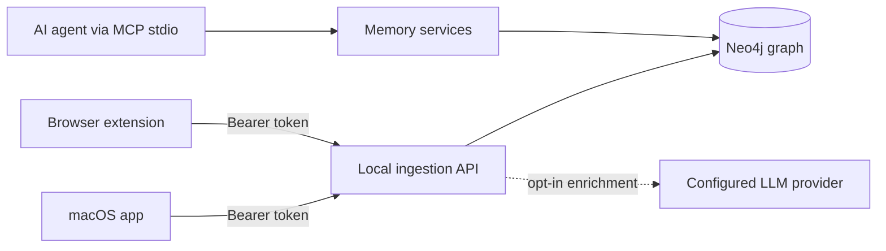

# Neural Memory

Neural Memory turns the context you choose to share into a private, searchable knowledge graph. It connects a local capture layer with an MCP memory server, so both you and your AI tools can recover the projects, decisions and open loops behind your work.

This repository is the next step of `mcp-neuralmemory`: one product, one local stack and explicit control over capture.

> Neural Memory is under active development. The graph server is usable today. The macOS app and browser extension are early previews and start with capture disabled.

## Why it is different

- **Local-first storage.** Neo4j and the ingestion API bind to loopback by default.
- **Consent before collection.** Activity, screenshots and typed text are separate opt-ins.
- **Useful without an AI key.** Capture and graph storage work without any LLM provider.
- **Provider-neutral enrichment.** Optional enrichment can use a LiteLLM gateway or Gemini directly.
- **Agent-ready memory.** The existing MCP tools remain available over stdio.
- **Reproducible setup.** Docker packages the server and database; the bootstrap creates random local credentials.

## Quick start

You need Git, Docker Desktop (or Docker Engine with Compose v2) and `curl`.

```bash
git clone https://github.com/Hexecu/mcp-neuralmemory.git
cd mcp-neuralmemory
./scripts/bootstrap.sh
```

The script creates a private `.env`, builds the API, starts Neo4j and waits for a verified health response. It never overwrites an existing `.env`.

Verify the installation:

```bash
./scripts/doctor.sh
curl http://127.0.0.1:8765/health
```

Expected response:

```json
{"status":"ok","service":"neural-memory","version":"0.2.0"}
```

Explore your Knowledge Graph in the Neo4j Browser:
- **URL**: [http://127.0.0.1:8774](http://127.0.0.1:8774)
- **User**: `neo4j`
- **Password**: Found in your `.env` under `NEO4J_PASSWORD`

Run the end-to-end test suite:

```bash
make e2e
```

Your graph survives `docker compose down`. Removing the Docker volume deletes it, so back it up first.

## Capture clients

### macOS preview

Requirements: macOS 13 or later and Xcode Command Line Tools.

```bash
cd apps/macos
./bundle_app.sh
```

Open `NeuralMemoryAgent.app`, go to Settings and copy `KG_MCP_TOKEN` from the root `.env`. The bundle is unsigned and intended for local development. The app only checks connectivity at launch. It does not capture activity until you enable it, and screenshot and typed-text capture stay off until separately enabled.

### Browser extension preview

Open `chrome://extensions`, enable Developer mode and load `apps/browser-extension` as an unpacked extension. Add the same local API token in its popup, then explicitly enable capture. It sends the page title and URL without query parameters or fragments.

## Optional LLM enrichment

Base capture does not send data to an external model. To enable enrichment through an OpenAI-compatible LiteLLM gateway, edit `.env`:

```dotenv
LLM_ENABLED=true
LLM_MODE=litellm
LITELLM_BASE_URL=https://your-gateway.example/v1
LITELLM_API_KEY=...
LITELLM_MODEL=your-model-name
```

Restart only the API after changing configuration:

```bash
docker compose up -d --build api
```

When enrichment is enabled, captured text or screenshots may leave your machine for the configured provider. Read [the privacy model](docs/PRIVACY.md) first.

## MCP for coding agents

Neural Memory can be connected directly to AI coding tools (Claude Desktop, Cursor, Antigravity, OpenCode).

### One-command configuration

Run the setup helper to display or install the MCP configuration:

```bash
make mcp
# Or auto-install into Claude Desktop:
./scripts/setup-mcp.sh --claude
```

### Manual development setup

For local development or manual MCP setup, install the package in an editable venv:

```bash
cd server
python3 -m venv .venv
source .venv/bin/activate
python -m pip install -e .
kg-mcp --transport stdio
```

The current stdio tools preserve the original project-memory workflow. A unified authenticated HTTP transport is on the roadmap.

## Architecture


```mermaid
flowchart LR
    Mac[macOS app] -->|Bearer token| API[Local ingestion API]
    Browser[Browser extension] -->|Bearer token| API
    Agent[AI agent via MCP stdio] --> Memory[Memory services]
    API --> Neo4j[(Neo4j graph)]
    Memory --> Neo4j
    API -. opt-in enrichment .-> LLM[Configured LLM provider]
```

The API stores events and graph relationships in Neo4j. Screenshot pixels are used transiently for hashing and, only when enabled, enrichment; they are not persisted by the ingestion endpoint.

## Development

```bash
cd server
python3.11 -m venv .venv
source .venv/bin/activate
python -m pip install -e '.[dev]'
pytest -q
ruff check src/kg_mcp/api.py src/kg_mcp/config.py src/kg_mcp/main.py tests/test_api.py tests/test_scoring.py

cd ../apps/macos
swift build
```

Useful root commands are listed by `make help`. See [CONTRIBUTING.md](CONTRIBUTING.md) for the acceptance checks used by the project.

## Current boundaries

- The desktop client is macOS-only today.
- Capture clients are preview-quality and not yet signed or notarized.
- Deep search and automated graph promotion are experimental.
- Docker is the supported zero-configuration server path.

Security reports belong in the private channel described in [SECURITY.md](SECURITY.md), not in a public issue.

## License

MIT. See [LICENSE](LICENSE).
