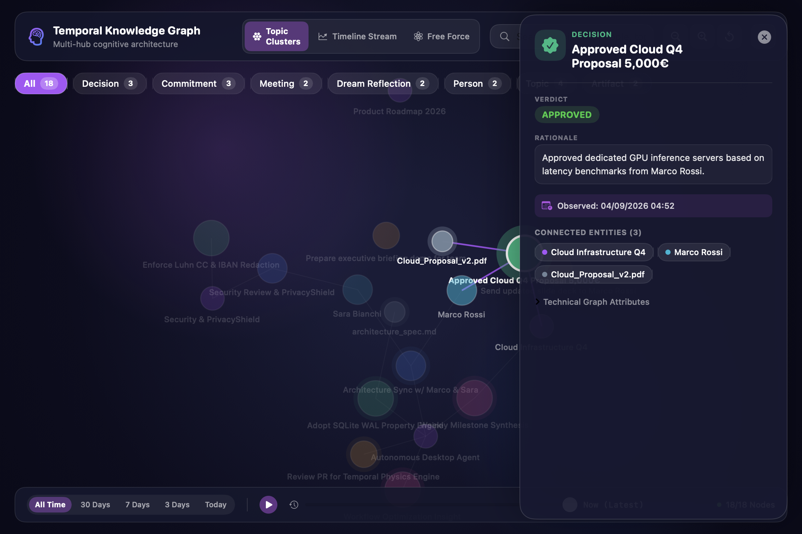
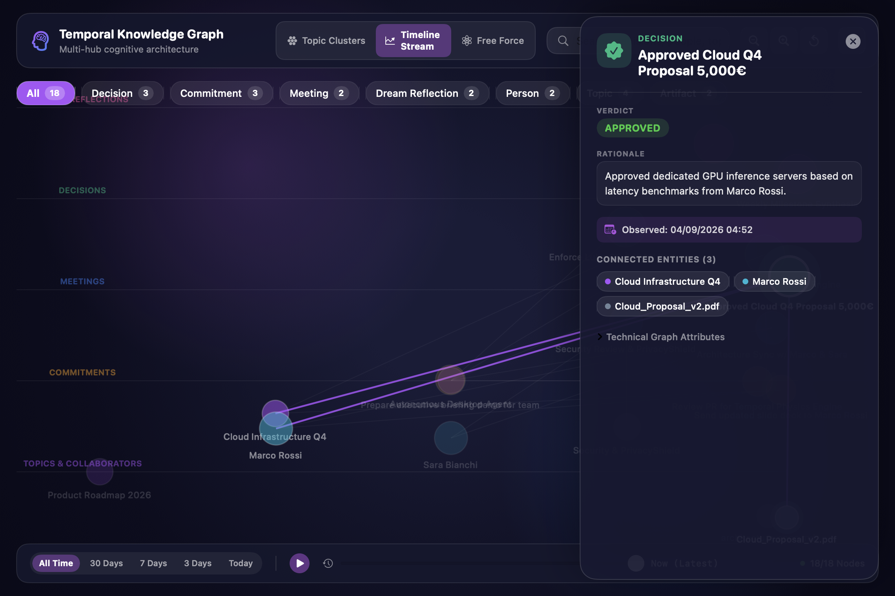
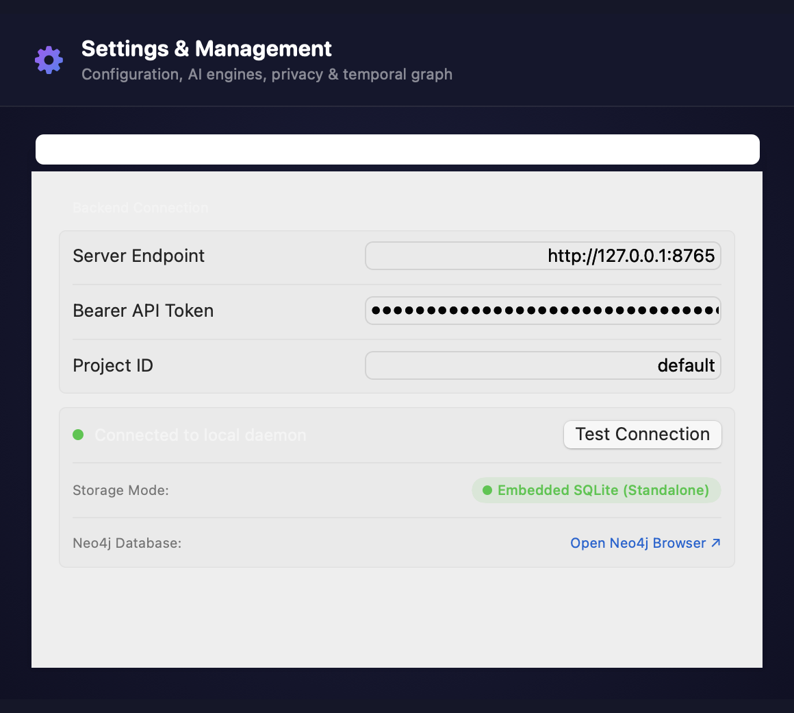

# Neural Memory for macOS (NeuralMemoryAgent)

`NeuralMemoryAgent` is a native macOS application built with Swift and SwiftUI. It acts as both your **personal contextual capture agent** and your **interactive temporal knowledge graph explorer**.

<p align="center">
  
</p>

---

## 1. Key Features

- **Menu Bar Assistant**: Sits discreetly in your macOS status bar with quick toggles for *Pause Capture*, *Private Mode*, *Open Graph*, and *Settings*.
- **Interactive Permissions Setup Wizard**: A clean 4-step first-launch guide featuring visual System Settings mockups for macOS Accessibility and Screen Recording.
- **Temporal Knowledge Graph Window**:
  - **🌌 Topic Clusters Mode**: Force-directed graph with orbital regional gravity, organizing thoughts into thematic galaxies without central collapse.
  - **⏳ Timeline Stream Mode**: Horizontal chronological stream with 5 vertical semantic altitude tracks (*Reflections*, *Decisions*, *Meetings*, *Commitments*, *Topics*).
  - **Interactive Time-Travel Scrubber**: Slider to replay memory genesis over time with range presets (`All Time`, `30 Days`, `7 Days`, `3 Days`, `Today`).
  - **Cognitive Inspector**: Click any node to review decisions, rationale, deadlines, participants, and jump to connected neighbor nodes.
- **Dynamic Dual-Track Execution**:
  - **Track B (Standalone Packed)**: Self-contained child daemon supervisor (`EmbeddedDaemonManager.swift`) running on an embedded SQLite graph database (`~/Library/Application Support/NeuralMemory/memory.db`). **Zero Docker required**.
  - **Track A (Open Local)**: Seamlessly attaches to your local Docker Compose + Neo4j stack if active on port `8765`.
- **PrivacyShield Integration**: Proactively ignores password managers, banking apps, and incognito windows, while redacting sensitive tokens and credentials on-the-fly.

<p align="center">
  
</p>

---

## 2. Installation & First-Time Setup

<p align="center">
  
</p>

### Option A: Drag-and-Drop DMG Installer (Recommended for Users)
Download `NeuralMemoryAgent-0.2.0-Installer.dmg`, double-click to mount, and drag `NeuralMemoryAgent.app` to your `/Applications` folder. See [docs/STANDALONE_INSTALLER.md](../../docs/STANDALONE_INSTALLER.md).

### Option B: Build Development Bundle from Source
Requirements: macOS 13 or later and Xcode Command Line Tools.

```bash
cd apps/macos
./bundle_app.sh
open NeuralMemoryAgent.app
```

### Option C: Build Release DMG Installer
From the repository root:
```bash
make package
```
Generates `dist/NeuralMemoryAgent-0.2.0-Installer.dmg` (112 MB).

---

## 3. Configuration & Settings

<p align="center">
  
</p>

Open **Settings & Preferences** (`⌘,` or via the gear icon in the Graph toolbar):

- **Server Tab**:
  - Displays the active **Storage Mode**:
    - 🟢 `Embedded SQLite (Standalone)` (running natively without Docker).
    - 🔵 `Open Local (Neo4j / Docker)` (attached to Docker stack).
  - Endpoint URL (default: `http://127.0.0.1:8765`).
  - Token field (automatically loaded from Keychain or `~/Library/Application Support/NeuralMemory/token.txt`).
  - Real-time **Test Connection** button and link to the Neo4j Browser.
- **Cognitive / LLM Tab**:
  - Status of enrichment provider (LiteLLM / Gemini).
  - **Trigger Dream Mode**: Manually run an off-cycle memory consolidation and reflection cycle.
- **Capture & Privacy Tab**:
  - Individual toggles for *Window Focus & App Activity*, *Visual Context (Screenshots)*, and *Keystroke Buffer*.
- **Temporal Graph Tab**:
  - Default layout selector (*Topic Clusters* vs *Timeline Stream*).
  - Memory decay half-life slider (12h to 168h) for the Ebbinghaus retention curve.
- **Permissions Tab**:
  - Live status check, direct shortcuts to macOS Privacy panels, and button to **Reopen Visual Setup Wizard...**.

---

## 4. Running Tests

```bash
cd apps/macos
swift test
```
Executes 15 comprehensive unit, UI contract, and scale tests, including a full **500-node, 1,200-edge physical simulation** asserting convergence and bounded velocity.
