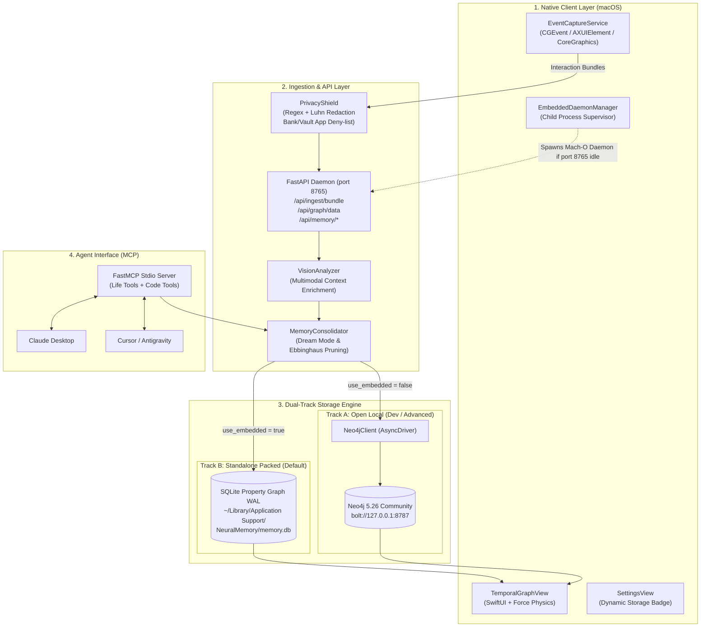

# Neural Memory — System Architecture & Technical Specification

Neural Memory is a **local-first personal cognitive memory assistant and second brain** that bridges the desktop context you choose to share with an autonomous knowledge graph and an MCP memory server for AI agents.

This document details the architectural design, subsystems, data flow pipelines, and dual-track execution model.

---

## 1. High-Level Architectural Overview

Neural Memory follows a **Dual-Track Execution Model** to accommodate both non-technical Mac users who need a zero-configuration drag-and-drop app and developers who want a full Docker/Neo4j development environment:

---

## 2. Dual-Track Execution Model

| Dimension | Track A: Open Local / Dev | Track B: Standalone Packed (Installer) |
| :--- | :--- | :--- |
| **Primary Target** | Developers, contributors, power users | General MacBook users, non-technical executives |
| **Prerequisites** | Docker Engine, Compose v2, Python 3.11+, Git | **Zero prerequisites** (no Docker, no Python, no Brew) |
| **Storage Engine** | Neo4j 5.26 Community (Cypher graph queries) | Embedded SQLite Property Graph in WAL mode |
| **Daemon Execution** | Docker container (`mcp-neuralmemory-publish-api-1`) | Self-contained Mach-O arm64 binary (`neural-memory-daemon`) |
| **Process Management** | Docker daemon (`docker compose up/down`) | Swift `EmbeddedDaemonManager` (child `Process()`) |
| **Visualizer** | Web Browser (`:8774`) & Swift UI App | Integrated Swift UI App & local HTML5/D3 visualizer |
| **Build Command** | `make up` / `make setup` | `make package` (creates `.dmg` installer) |
| **Verification** | `make doctor` & `make e2e` | `make verify-clean` |

### Auto-Discovery & Transparent Fallback
When `NeuralMemoryAgent.app` launches:
1. `EmbeddedDaemonManager.shared.ensureDaemonRunning()` polls `http://127.0.0.1:8765/health`.
2. **If responding** (Track A is active):
   - The app attaches seamlessly to the running Docker API and Neo4j cluster.
   - `AppState.shared.storageMode` is set to `open_local_neo4j`.
3. **If not responding** (clean Mac with Docker shut down):
   - The app looks inside its bundle (`Contents/MacOS/neural-memory-daemon`).
   - Spawns the Mach-O binary as a child background process binding to loopback port `8765`.
   - Daemon detects missing `NEO4J_PASSWORD` or offline Neo4j, activating `use_embedded = True`.
   - Routes all graph nodes and edges to `~/Library/Application Support/NeuralMemory/memory.db`.
   - `AppState.shared.storageMode` is set to `embedded_sqlite`.

---

## 3. Subsystem Breakdown

### 3.1 Ingestion & Multimodal Interaction Bundles
Instead of capturing disjointed periodic screenshots and random keystroke buffers, Neural Memory uses **Interaction Bundles**:
- **Boundary Triggers**: Bundles are dispatched on natural human action boundaries:
  - Return / Enter / Cmd+Enter keypress (sending an email or chat message).
  - Application focus change (switching between IDE, browser, Slack).
  - Debounce timer (2.5 seconds of user idle after typing).
- **Bundle Payload**:
  - Contextual screen state (active app, window title, sanitized URL).
  - Optional visual screenshot (processed via perceptual `dhash` visual deduplication).
  - Immediate user typed text buffer (e.g. *"Ok, procedi pure"*).

### 3.2 PrivacyShield Pipeline
Privacy is enforced locally *before* any persistence or optional LLM enrichment:
1. **App / Window Deny-List**:
   - Explicitly blocks and ignores captures from password managers (`1Password`, `Bitwarden`, `Apple Keychain`, `KeePassXC`).
   - Blocks banking windows, private browsing windows (`Incognito`, `InPrivate`), and secret notes.
2. **Data Masking & Redaction**:
   - **Credit Cards**: Validated and redacted via regex + Luhn checksum verification.
   - **IBAN**: Redacted via ISO 13616 international standard matching.
   - **API Keys**: Redacted via high-entropy key patterns (OpenAI `sk-...`, Gemini `AIza...`, GitHub `ghp_...`, Bearer tokens).
   - **Passwords**: Redacted via inline heuristic detectors.

### 3.3 Consolidator & Dream Mode
Neural memory implements a cognitive sleep cycle inspired by human memory consolidation:
- **Ephemeral Event Pruning**: Low-level mouse and keyboard events are retained for 48 hours and then purged, leaving durable semantic nodes intact.
- **Topic Deduplication**: Uses semantic similarity and graph clustering to merge duplicate topics (e.g. *"Cloud Architecture"* and *"AWS Infra"*).
- **Reflection Generation**: Synthesizes periodic higher-order insights (`Reflection` nodes) summarizing key milestones and progress.
- **Executive Daily Briefing**: Compiles decisions taken, outstanding commitments, and meeting notes into an actionable agenda.

### 3.4 Temporal Knowledge Graph Engine
The graph visualizer in the Swift application uses an advanced dual-layout physics engine:
- **Regional Topic Orbit Gravity**: Repels nodes Coulombically while attracting them magnetically to their dominant topic cluster, completely avoiding the classical "central collapse ball" problem.
- **Timeline Stream Layout**: Linear horizontal time axis mapping chronological progression with 5 semantic altitude lanes:
  1. Top Lane: *Dream Reflections & Insights*
  2. Second Lane: *Strategic Decisions*
  3. Third Lane: *Meeting Sessions*
  4. Fourth Lane: *Action Items & Commitments*
  5. Bottom Lane: *Topics & Collaborators*
- **Ebbinghaus Memory Decay**: Node visual intensity decays logarithmically based on $R = e^{-t / S}$, where recently reinforced nodes pulse vividly and dormant memories fade gracefully.

---

## 4. MCP Agent Protocol Specification

Neural Memory exposes a Model Context Protocol (MCP) server over standard input/output (`stdio`), enabling any AI coding agent to query your second brain:

- **Life & Work Memory Tools**:
  - `recall_decisions(topic, person, limit)`
  - `recall_commitments(status, debtor, limit)`
  - `recall_meetings(topic, attendee, limit)`
  - `get_daily_briefing(date)`
- **Project & Code Memory Tools**:
  - `search(query, limit)`
  - `get_project_context(project_id)`
  - `save_project_context(project_id, context)`

---

## 5. Security & Isolation Guarantee

- **Loopback Binding**: Both HTTP API (`127.0.0.1:8765`) and Neo4j (`127.0.0.1:8787`) strictly bind to the loopback interface, preventing LAN exposure.
- **Authentication**: All mutation and query endpoints require a 256-bit cryptographically secure Bearer token stored in `~/Library/Application Support/NeuralMemory/token.txt` or macOS Keychain.
- **No Cloud Dependency**: In Standalone mode, zero bytes leave your MacBook unless you explicitly configure an external LLM API key in settings.
