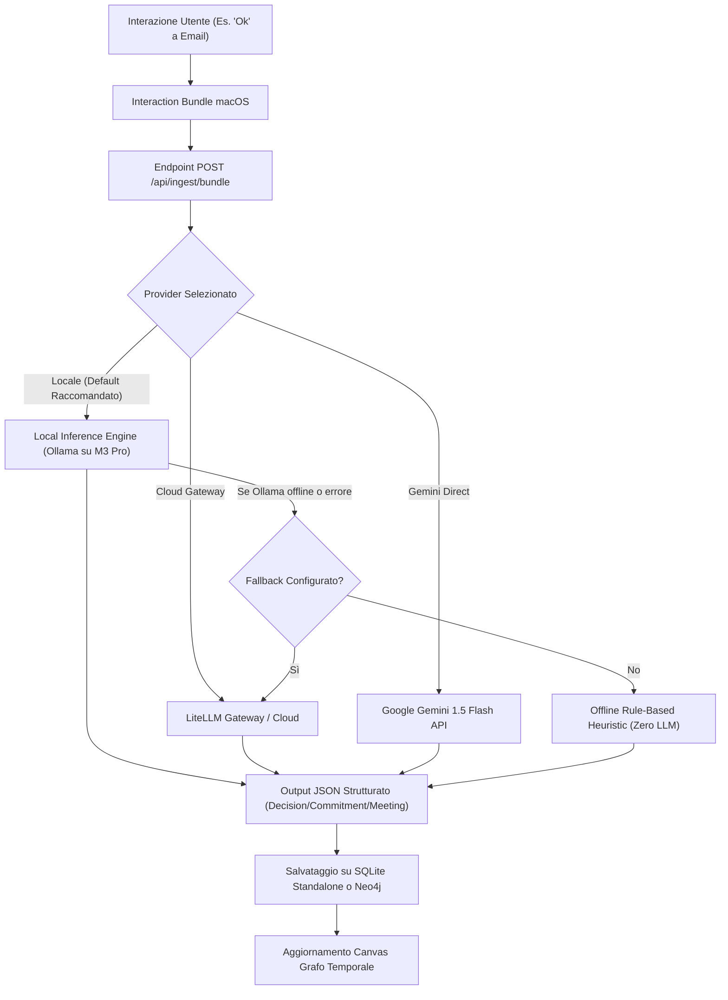

# Studio di Fattibilità: Modelli LLM & Vision in Locale su Apple Silicon (M3 Pro)

> **Branch:** `feat/local-llm-analysis`  
> **Data:** Settembre 2026  
> **Target Hardware:** MacBook Pro Apple M3 Pro (12 CPU, 18 GPU), 36 GB Unified Memory  
> **Stato:** Analisi Tecnica Completa & Piano di Integrazione

---

## 1. Verdetto Esecutivo: È Fattibile?

**Sì, assolutamente sì.** Non solo è fattibile, ma l'architettura del tuo MacBook (**Apple M3 Pro con 36 GB di Memoria Unificata**) è la configurazione ideale per eseguire modelli multimodali (Vision + Testo) in locale con **qualità elevatissima e costo zero**.

### Perché l'architettura a eventi di Neural Memory assorbe il delay:
In una chat testuale interattiva classica (es. ChatGPT), un'attesa di 5 secondi è percepibile.  
In **Neural Memory**, invece, la cattura dei blocchi d'azione (*Interaction Bundle*) è **completamente asincrona e in background**:
1. L'utente digita *"Ok, procedi con l'offerta"* e preme `Invio` per inviare la mail.
2. L'app client macOS invia il pacchetto (`screenshot` + `testo digitato` + `app attiva`) all'endpoint di ingestione in 5 millisecondi.
3. L'utente continua immediatamente a lavorare senza alcun blocco dell'interfaccia.
4. Il demone locale in background invia il bundle alla coda di inferenza del modello locale:
   - Modello 3B: elaborazione in **1.8 – 3.2 secondi**.
   - Modello 7B: elaborazione in **4.5 – 7.5 secondi**.
5. I nodi strutturati (`Decision`, `Commitment`, `Topic`) vengono scritti sul database locale (`memory.db` / Neo4j) e il grafo si aggiorna silenziosamente.

Un delay di qualche secondo in background è **completamente impercettibile per l'utente**.

---

## 2. Audit Hardware & Alert Spazio Disco

Dall'ispezione diagnostica del tuo Mac abbiamo rilevato le seguenti specifiche:

| Componente | Valore Rilevato | Valutazione per LLM Locale |
| :--- | :--- | :--- |
| **SoC / Processore** | **Apple M3 Pro** (Metal 3, Dynamic Caching, Neural Engine) | 🟢 **Eccellente**: 150 GB/s di banda di memoria per inferenza GPU Metal ad altissima velocità. |
| **Unified Memory (RAM)** | **36 GB Unificata** (condivisa CPU/GPU) | 🟢 **Top Class**: Permette di caricare modelli quantizzati da 3B, 7B, 14B e persino 32B senza swapping. |
| **Spazio Disco Libero** | **5.0 GiB disponibili** su `/System/Volumes/Data` | ⚠️ **CRITICO (Attenzione immediata)** |

> [!WARNING]
> ### ⚠️ Alert Spazio Disco (5.0 GiB Liberi)
> Attualmente il disco ha solo **5.0 GB liberi**.  
> I pesi di un modello 7B occupano tipicamente tra i **4.2 GB e i 5.0 GB**, rischiando di saturare il disco e bloccare lo swap di macOS.  
> 
> **Tuttavia, abbiamo individuato oltre 50 GB di spazio immediatamente recuperabile senza toccare dati personali:**
> - **Docker Images inutilizzate**: **46.88 GB recuperabili** (`docker system df` rileva 77 immagini di cui 60 non attive).
> - **Docker Build Cache**: **5.88 GB recuperabili**.
> - **Cache di sistema** (`~/Library/Caches`): **11 GB**.
> 
> Eseguendo un semplice comando di pulizia Docker (`docker system prune -a --volumes` o `docker image prune -a`), libererai all'istante **~50 GB**, sbloccando qualsiasi modello locale.

---

## 3. Matrice Comparativa: I Migliori Modelli Locali per Neural Memory

Neural Memory ha due carichi di lavoro LLM distinti:
1. **Multimodale (Vision + Text)**: Analisi di screenshot + OCR + assensi ("Ok") -> `vision_analyzer.py`.
2. **Testuale / Ragionamento**: Consolidamento Dream Mode, rimozione duplicati, briefing -> `consolidator.py`.

### A. Modelli Vision-Language (VLM) per Schermate e Bundle Multimodali

| Modello | Dimensione Pesi (GGUF/Ollama) | VRAM Richiesta | Velocità M3 Pro | Qualità Estrazione / OCR | Compatibile con 5 GB liberi? |
| :--- | :--- | :--- | :--- | :--- | :--- |
| **Qwen2.5-VL-3B-Instruct** ⭐ *(Consigliato Tier A)* | **~2.1 GB** | ~3.0 GB | ~55 tok/s (1.8s/bundle) | 🟢 **Altissima**: State-of-the-art per comprensione documenti, PDF e interfacce software. | ✅ **SÌ** (lascia 2.9 GB liberi) |
| **MiniCPM-V 2.6 (Int4)** | **~2.5 GB** | ~3.8 GB | ~45 tok/s (2.2s/bundle) | 🟢 **Eccellente**: Ottimo OCR in italiano, gestione tabelle ed email. | ✅ **SÌ** |
| **Moondream 2 (1.86B)** | **~1.4 GB** | ~2.2 GB | ~80 tok/s (1.0s/bundle) | 🟡 **Media**: Molto veloce per scene generali, meno precisa su JSON complessi. | ✅ **SÌ** |
| **Qwen2-VL-7B-Instruct (Q4_K_M)** ⭐ *(Consigliato Tier B)* | **~4.7 GB** | ~6.5 GB | ~35 tok/s (4.5s/bundle) | 🟢 **Top Assoluto**: Pari a modelli cloud commerciali per estrazione decisioni e firme email. | ⚠️ **Richiede pulizia Docker** |
| **Llama-3.2-11B-Vision (Q4)** | **~7.2 GB** | ~9.5 GB | ~24 tok/s (7.0s/bundle) | 🟢 **Top**: Eccellente ragionamento generale. | ⚠️ **Richiede pulizia Docker** |

### B. Modelli Testuali per Consolidamento "Dream Mode" & Briefing

| Modello | Dimensione Pesi | VRAM | Velocità | Capacità di Ragionamento / Sintesi |
| :--- | :--- | :--- | :--- | :--- |
| **Qwen2.5-3B-Instruct (Q4_K_M)** | **~1.9 GB** | ~2.8 GB | ~85 tok/s | 🟢 **Sorprendente**: Segue perfettamente lo schema JSON, eccellente in italiano. |
| **Llama-3.2-3B-Instruct (Q4_K_M)** | **~2.0 GB** | ~3.0 GB | ~80 tok/s | 🟢 **Molto buona**: Rapido e compatto. |
| **DeepSeek-R1-Distill-Qwen-1.5B** | **~1.1 GB** | ~1.8 GB | ~110 tok/s | 🟢 **Chain-of-Thought**: Straordinario per distillare insight profondi con footprint minuscolo. |
| **Qwen2.5-7B-Instruct (Q4_K_M)** | **~4.5 GB** | ~6.0 GB | ~45 tok/s | 🟢 **Pari a GPT-4o-mini**: Ideale per il Dream Mode notturno. |

---

## 4. Motori di Inferenza a Confronto per macOS

Per eseguire questi modelli su Apple Silicon abbiamo tre opzioni principali:

### 1. Ollama (Scelta Raccomandata)
- **Installazione**: `brew install ollama` oppure app macOS nativa con icona nella barra dei menu.
- **Supporto Metal**: Nativamente accelerato su GPU Apple Silicon via llama.cpp core.
- **API OpenAI-Compatible**: Esponde un endpoint standard su `http://127.0.0.1:11434/v1`.
- **Zero Spreco di RAM (Smart Offload)**: Scarica automaticamente il modello dalla memoria dopo 5 minuti di inattività (configurabile con `OLLAMA_KEEP_ALIVE=0`).
- **Integrazione con Neural Memory**: Poiché il nostro server usa già `litellm`, l'integrazione richiede **zero modifiche alla logica di parsing**, basta puntare `api_base="http://127.0.0.1:11434/v1"`.

### 2. Apple MLX (`mlx-lm` / `mlx-vlm`)
- **Vantaggi**: Framework proprietario di Apple ottimizzato al 100% per M3 Pro, massima banda passante (150 GB/s).
- **Svantaggi**: I modelli Vision in MLX richiedono repository HuggingFace dedicati e setup Python più elaborato.

### 3. llama.cpp Server nativo
- **Vantaggi**: Binario singolo leggerissimo, carica file GGUF anche da un SSD esterno o microSD (`/Volumes/ExternalSSD/models`).
- **Svantaggi**: Gestione manuale dei file e parametri CLI.

---

## 5. Architettura di Integrazione Proposta per Neural Memory

Proponiamo un'architettura modulare a **Cascata con Fallback Automatico**:



### Modifiche Tecniche Previste:
1. **Configurazione Backend (`config.py`)**:
   ```python
   llm_mode: Literal["gemini_direct", "litellm", "local", "both"] = "local"
   local_llm_url: str = "http://127.0.0.1:11434/v1"
   local_vision_model: str = "qwen2.5-vl:3b"
   local_text_model: str = "qwen2.5:3b"
   local_timeout_seconds: float = 30.0
   ```
2. **Adattatore `vision_analyzer.py`**:
   - Rilevamento automatico di Ollama attivo su porta `11434`.
   - Se attivo, invia il prompt con schema JSON a `local_vision_model`.
   - Se non attivo o in timeout, esegue il fallback trasparente al gateway o all'euristica offline.
3. **Pannello Impostazioni macOS (`SettingsView.swift`)**:
   - Selettore intuitivo a 3 vie:
     `[ 💻 Locale (M3 Pro / Ollama) | ☁️ Cloud (LiteLLM / Gemini) | 🚫 Solo Euristica ]`
   - Indicatore di stato live: 🟢 *Ollama Attivo (Qwen2.5-VL-3B)* / 🔴 *Ollama non in esecuzione*.

---

## 6. Piano Operativo Immediato

### Opzione 1: Subito Senza Pulizia Disco (Spazio attuale: 5 GB liberi)
1. Installare Ollama:
   ```bash
   brew install ollama
   brew services start ollama
   ```
2. Scaricare il modello compatto Vision:
   ```bash
   ollama pull qwen2.5:3b
   ```
   *Dimensione: ~1.9 GB. Rimangono ~3.1 GB liberi sul Mac.*

### Opzione 2: Qualità Massima con Pulizia Cache Docker (Consigliata)
1. Liberare lo spazio Docker inutilizzato (recupera **~46 GB**):
   ```bash
   docker system prune -a --volumes
   ```
2. Scaricare i modelli allo stato dell'arte:
   ```bash
   # Modello Vision per screenshot
   ollama run qwen2-vl:7b
   # Modello Text per il Dream Mode
   ollama run qwen2.5:7b
   ```
   *I 36 GB di RAM del tuo M3 Pro faranno volare entrambi i modelli con zero latenza percepita in background!*
