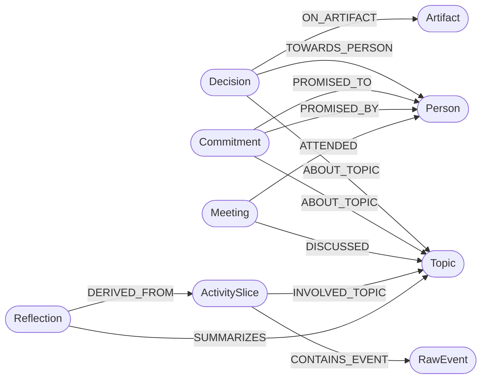

# Cognitive Knowledge Graph Ontology Specification

Neural Memory models your digital work and personal life as a semantic property graph. This document specifies the entity node schemas, relationship edges, indexing properties, and query patterns.

---

## 1. Core Node Schemas

### 1.1 `Decision`
Represents an explicit approval, rejection, architectural choice, or agreement reached by the user or their team.

| Property | Type | Description | Example |
| :--- | :--- | :--- | :--- |
| `id` | `String (UUID)` | Unique decision identifier | `"d-a812f0c1"` |
| `title` | `String` | Concise summary of the decision | `"Approve Cloud Q4 Quote for 5000 EUR"` |
| `verdict` | `String` | `APPROVED` \| `REJECTED` \| `PENDING` | `"APPROVED"` |
| `rationale` | `String` | Context or reasoning behind the choice | `"User confirmed email proposal within budget"` |
| `subject` | `String` | Topic or artifact decided upon | `"Cloud Q4 Proposal"` |
| `timestamp` | `DateTime (ISO8601)` | Timestamp when decision occurred | `"2026-09-03T14:10:00Z"` |
| `project_id` | `String` | Associated project partition | `"default"` |

### 1.2 `Commitment`
Represents an action item, deliverable, or promise made *by* the user to someone else, or *to* the user by a collaborator.

| Property | Type | Description | Example |
| :--- | :--- | :--- | :--- |
| `id` | `String (UUID)` | Unique commitment identifier | `"c-4b9981e2"` |
| `title` | `String` | Brief description of the task | `"Send updated slides by Friday 18:00"` |
| `task` | `String` | Detailed deliverable description | `"Prepare presentation slides and email them"` |
| `due_date` | `DateTime (ISO8601)` | Resolved deadline | `"2026-09-05T18:00:00Z"` |
| `status` | `String` | `open` \| `in_progress` \| `completed` \| `cancelled` | `"open"` |
| `debtor` | `String` | Person responsible for fulfilling (`user` or name) | `"user"` |
| `creditor` | `String` | Person expecting the deliverable | `"Giulia Bianchi"` |
| `project_id` | `String` | Associated project partition | `"default"` |

### 1.3 `Meeting`
Represents a collaborative video call, voice sync, or calendar event detected through meeting applications (Google Meet, Zoom, Microsoft Teams, Slack Huddle).

| Property | Type | Description | Example |
| :--- | :--- | :--- | :--- |
| `id` | `String (UUID)` | Unique meeting identifier | `"m-90a1bc33"` |
| `title` | `String` | Title of the meeting | `"Architecture Sync with Roberto & Francesca"` |
| `start_time` | `DateTime (ISO8601)` | Start timestamp | `"2026-09-03T10:00:00Z"` |
| `end_time` | `DateTime (ISO8601)` | End timestamp | `"2026-09-03T10:45:00Z"` |
| `attendees` | `List[String]` | Names of identified participants | `["Francesca", "Roberto"]` |
| `summary` | `String` | AI-generated discussion summary | `"Decided on hybrid Neo4j/vector architecture"` |

### 1.4 `Reflection` / `Insight`
Higher-order cognitive abstractions generated during **Dream Mode** memory consolidation.

| Property | Type | Description | Example |
| :--- | :--- | :--- | :--- |
| `id` | `String (UUID)` | Unique reflection identifier | `"r-77e812d0"` |
| `category` | `String` | `productivity` \| `architecture` \| `milestone` | `"architecture"` |
| `topic` | `String` | Main conceptual focus | `"Storage Scalability"` |
| `synthesis` | `String` | Consolidated insight derived from multiple slices | `"Transition to SQLite eliminates Docker friction"` |
| `created_at` | `DateTime (ISO8601)` | Consolidation run timestamp | `"2026-09-03T02:00:00Z"` |

### 1.5 `ActivitySlice`
A 15-to-30 minute consolidated block of user workflow combining multiple raw interaction bundles.

| Property | Type | Description | Example |
| :--- | :--- | :--- | :--- |
| `id` | `String (UUID)` | Unique slice identifier | `"as-312019ab"` |
| `start_time` | `DateTime (ISO8601)` | Slice start | `"2026-09-03T09:00:00Z"` |
| `end_time` | `DateTime (ISO8601)` | Slice end | `"2026-09-03T09:30:00Z"` |
| `summary` | `String` | Executive summary of activity | `"Researching zero-config Mac packaging"` |
| `apps` | `List[String]` | Applications used | `["Safari", "Xcode", "Terminal"]` |
| `confidence` | `Float` | Semantic parsing confidence score | `0.92` |

---

## 2. Relationship Semantics (Edges)



| Relationship | Source Node | Target Node | Semantic Meaning |
| :--- | :--- | :--- | :--- |
| `[:TOWARDS_PERSON]` | `Decision` | `Person` | The person to whom an approval or decision was directed. |
| `[:ABOUT_TOPIC]` | `Decision`, `Commitment` | `Topic` | The conceptual subject matter of the item. |
| `[:ON_ARTIFACT]` | `Decision` | `Artifact` | The specific quote, document, pull request, or file decided upon. |
| `[:PROMISED_TO]` | `Commitment` | `Person` | The creditor expecting delivery of the promise. |
| `[:PROMISED_BY]` | `Commitment` | `Person` | The person responsible for completing the task. |
| `[:ATTENDED]` | `Meeting` | `Person` | A participant present in the collaborative meeting. |
| `[:DISCUSSED]` | `Meeting` | `Topic` | An agenda topic or subject debated during the call. |
| `[:DERIVED_FROM]` | `Reflection` | `ActivitySlice` | Slices used by the consolidator to deduce the insight. |

---

## 3. Query Examples

### Finding All Decisions Involving a Specific Colleague (Cypher / Neo4j)
```cypher
MATCH (d:Decision)-[:TOWARDS_PERSON]->(p:Person {name: "Marco Rossi"})
RETURN d.title, d.verdict, d.rationale, d.timestamp
ORDER BY d.timestamp DESC
LIMIT 10;
```

### Finding All Open Commitments with Upcoming Deadlines (Cypher / Neo4j)
```cypher
MATCH (c:Commitment)
WHERE c.status = "open" AND c.due_date IS NOT NULL
OPTIONAL MATCH (c)-[:PROMISED_TO]->(p:Person)
RETURN c.title, c.due_date, c.debtor, coalesce(p.name, c.creditor) as creditor
ORDER BY c.due_date ASC;
```

### Querying Graph Data via Embedded SQLite Engine
In Standalone mode, relations are stored in the SQLite tables `nodes` and `links`:
```sql
SELECT n.id, n.label, n.properties, n.timestamp
FROM nodes n
JOIN links l ON (n.id = l.target_id)
WHERE l.source_id = "dec_001" AND l.rel_type = "ABOUT_TOPIC";
```
