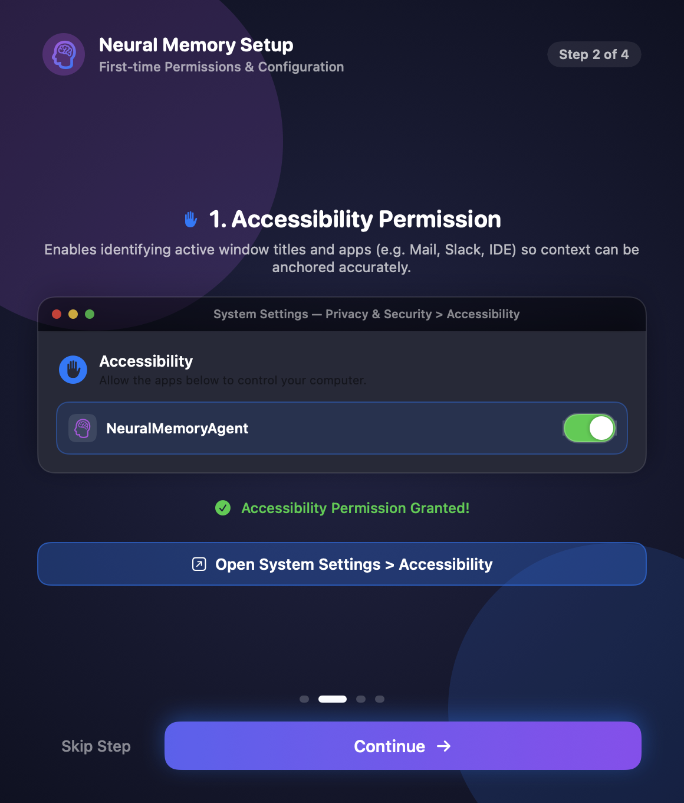

# Neural Memory

<div align="center">

[](STANDALONE_INSTALLER.md)
[-success.svg)](ARCHITECTURE.md)
[](TESTING.md)
[](STANDALONE_INSTALLER.md)
[](https://github.com/Hexecu/mcp-neuralmemory/blob/main/LICENSE)

<p align="center">
  <b>A local-first personal cognitive memory assistant and second brain for macOS.</b><br>
  Transforms human desktop context into an autonomous, searchable knowledge graph — anchoring decisions, tracking commitments, and exposing context directly to AI tools via MCP.
</p>


</div>

---

## ⚡ Quick Start: Choose Your Track

=== "Track B: Standalone Packed (Recommended for Users)"

    > **Zero prerequisites. No Docker, no Python, no Homebrew, no terminal required.**

    1. Download [**`NeuralMemoryAgent-0.2.0-Installer.dmg`**](https://github.com/Hexecu/mcp-neuralmemory/releases/tag/v0.2.0) (approx. 112 MB).
    2. Open the disk image and drag **`NeuralMemoryAgent.app`** to your **Applications** folder.
    3. Launch the app from Applications. The built-in **Visual Setup Wizard** guides you through the minimal required macOS entitlements.

    <div align="center">
      
    </div>

    *Read the full [Standalone Installer Guide](STANDALONE_INSTALLER.md).*

=== "Track A: Open Local (For Developers & Contributors)"

    > **Full Docker Compose + Neo4j 5.26 Community Graph Database.**

    ```bash
    git clone https://github.com/Hexecu/mcp-neuralmemory.git
    cd mcp-neuralmemory
    ./scripts/bootstrap.sh
    ```

    - Diagnostic verification: `./scripts/doctor.sh`
    - API health: `http://127.0.0.1:8765/health`
    - Neo4j Browser: `http://127.0.0.1:8774`
    - Full test suite: `make test-massive`

---

## 🌟 Key Capabilities

### 🔒 PrivacyShield Local Redaction
In-memory regex and Luhn checksum filtering automatically masks credit cards, IBANs, API keys (`sk-...`, `AIza...`, GitHub tokens), and passwords before persistence or optional LLM enrichment. Sensitive vaults (`1Password`, `Bitwarden`, `Keychain`) are permanently denied.

### 🎯 Contextual Micro-Feedback Anchoring
Eliminates arbitrary length cutoffs. Assents like *"Ok, procedi con l'offerta da 5000€"* are anchored to the sender, document, and decision terms.

### 🌌 Temporal Knowledge Graph
- **Topic Clusters**: Force-directed layout with orbital regional gravity clusters related thoughts into thematic galaxies without central collapse.
- **Timeline Stream**: Horizontal chronological axis with 5 vertical semantic altitude lanes (*Reflections*, *Decisions*, *Meetings*, *Commitments*, *Topics*).
- **Time Scrubber**: Interactive slider to replay memory history with Ebbinghaus memory decay ($R = e^{-\Delta t / S}$).

### 🤖 Model Context Protocol (MCP)
Native `stdio` server providing tools for Claude Desktop, Cursor, and Antigravity: `recall_decisions`, `recall_commitments`, `recall_meetings`, `get_daily_briefing`, and `search`.

---

## 📚 Documentation Navigation

<div class="grid cards" markdown>

-   :material-layers-triple: **[System Architecture](ARCHITECTURE.md)**
    ---
    Deep technical dive into the Dual-Track execution model, data pipelines, and storage engines.

-   :material-apple: **[Standalone Installer Guide](STANDALONE_INSTALLER.md)**
    ---
    Step-by-step installation, permissions setup, and clean-environment testing on macOS.

-   :material-chart-bubble: **[Temporal Knowledge Graph](TEMPORAL_GRAPH.md)**
    ---
    Orbital physics model, semantic altitude lanes, time scrubber, and Ebbinghaus decay.

-   :material-graph: **[Cognitive Ontology](ONTOLOGY.md)**
    ---
    Entity schemas (`Decision`, `Commitment`, `Meeting`, `Reflection`), relationship semantics, and queries.

-   :material-robot: **[Model Context Protocol (MCP)](MCP_TOOLS.md)**
    ---
    Tool schemas and configuration guides for Claude Desktop, Cursor, and Antigravity.

-   :material-shield-lock: **[Privacy Model & PrivacyShield](PRIVACY.md)**
    ---
    Data flow guarantees, deny-lists, masking algorithms, and ephemeral event pruning.

-   :material-check-decagram: **[Testing & Verification](TESTING.md)**
    ---
    The 5-stage massive test battery (`make test-massive`) and clean simulation (`make verify-clean`).

</div>
